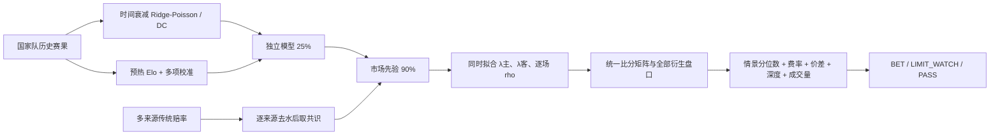

# 世界杯 Polymarket 预测模型 v3：新增材料审计与升级报告

**审计日期：2026-07-12**  
**目标：预测世界杯后续比赛，并把公平概率转换为考虑费率、订单簿、成交量和相关性的下注建议。**

## 1. 新增材料带来的结论

本轮审计覆盖 `walkforward_backtest_fast.py`、`predictions_walkforward.csv`、`metrics_walkforward.json`、`club_results.csv`、`club_metrics.json` 和新增研究报告。

1. 世界杯 Walk-Forward 提供了有用的逐场概率样本，但原脚本没有用 2014 年前比赛预热 Elo。每届世界杯开始时传入的 Elo 状态实际上为空，之后也主要只累积世界杯比赛。
2. 报告中的“高置信度公平 EV=+0.775”不是可交易收益。用模型自己的概率倒数作为公平赔率，理论期望应为零；不能把高置信度样本的总体命中率套到每场自报赔率上。
3. 俱乐部数据实际主要覆盖 2020–2024，而非报告所称的 2014–2024；第一组英超数据还存在 `league/season` 标签互换。它不适合直接训练国家队实力。
4. 俱乐部样本仍提供了重要的反证：模型 Brier 0.6202，市场 0.5763。用 2020–2022 拟合、2023–2024 检验，尖锐市场与独立模型的最佳混合权重是 100%/0%；旧版 70%/30% 混合会把测试 Brier 从 0.5734 恶化到 0.5776。

因此，v3 把俱乐部研究转化为“反过度自信约束”，而不是把俱乐部赛果混进国家队参数。

## 2. v3 模型结构



主要变化：

- 原始赛果不覆盖，新增 `regulation_score_overrides.csv`。挪威–英格兰和阿根廷–瑞士均按 90 分钟 1–1 进入 1X2 模型，而不是把加时后的 1–2、3–1误当作常规时间。
- 多个传统赔率先分别去水，再形成共识；Polymarket 仍只作为目标交易价格。
- 独立模型相对尖锐市场的权重由 30% 降到 10%。
- 逐场联合拟合主客预期进球和 Dixon–Coles `rho`，避免固定 `rho` 导致胜平负与大小球无法同时一致。
- 参数情景范围扩大到预期进球 ±15%、进球份额 ±7%，低可信盘口另扣 2.5pp。
- 早盘不降低 5pp 稳健边际。它只把可观察价差放宽到 3c，同时要求盘口成交量至少 $1,000。
- 单场只执行一个最强信号，防止把 1X2、让球、正确比分等高度相关合约误当作分散化。
- $10,000 本金下单笔/单场上限 0.5%，并受 2.5% Kelly 与一档卖盘深度 0.5% 的更小值约束。

## 3. 修正后的验证

| 区间 | 性质 | 场次 | Brier | Log Loss | RPS | 1X2准确率 |
|---|---|---:|---:|---:|---:|---:|
| 2014–2022 | 历史封存段 | 192 | 0.5928 | 0.9961 | 0.2118 | 54.7% |
| 2026 | 回看监控，不是最终测试 | 100 | 0.5168 | 0.8774 | 0.1624 | 63.0% |

协议：Poisson 在每届世界杯开始前冻结；Elo 用此前全部比赛预热，逐场预测后才更新。2026 指标是在赛事进行中、模型已经反复研究后的回看结果，不能作为未触碰测试宣传。当前仍缺少历史 Polymarket 订单簿，因此尚未证明策略具有正的真实交易收益。

## 4. 当前半决赛预测与盘口结论

订单簿快照：2026-07-12 15:58:54 UTC，共 136 个合约。

| 比赛（北京时间） | 主胜 | 平 | 客胜 | 大2.5 | BTTS | 预期进球 |
|---|---:|---:|---:|---:|---:|---:|
| 法国–西班牙（7月15日03:00） | 39.8% | 29.0% | 31.2% | 47.7% | 53.6% | 1.39–1.19 |
| 英格兰–阿根廷（7月16日03:00） | 36.6% | 30.4% | 33.0% | 43.5% | 50.6% | 1.25–1.17 |

结论是 **0 个立即可执行下注**。盘口的中心点存在小幅偏差，但在情景下界、费率和执行缓冲后，没有任何合约保留 5pp 稳健优势。

当前只保留条件观察：

- 法国–西班牙 BTTS=NO：当前卖价 41%，模型中心 46.4%，但 5pp 稳健最高入场价只有 32.0%，不追价。
- 法国–西班牙上半场 BTTS=NO：当前 79%，5pp 稳健最高 72.6%。
- 英格兰–阿根廷下半场大1.5：中心概率有偏差，但盘口深度 D、成交量极低，最高入场价 25.7%，当前 37%，不可执行。
- 主要 1X2 上，西班牙胜和阿根廷胜只有约 1pp 的扣费后中心优势，远低于稳健阈值。

“开赛尚早”确实可能产生陈旧价，但也同时意味着成交量低、信息尚未到达和盘口可被少量资金推动。正确的收割方式是挂远离卖一的条件限价并等待成交，而不是因为主观认为市场不理性就主动吃单。

## 5. 下一轮迭代优先级

1. 每 2–4 小时保存 Polymarket 与传统赔率快照，建立价格路径和赛前 CLV；没有 CLV，无法区分真实优势与偶然成交。
2. 首发公布后重跑，重点处理姆巴佩脚踝、体能恢复和临场阵容；不在首发前手工硬调概率。
3. 赛后按合约结算记录成交价、滑点、费率和 P&L，不能用中间价回测。
4. 世界杯结束后补齐历史 Polymarket 快照，再做市场概率、模型概率和融合概率的严格时间外比较。

## 6. 可复现入口

```powershell
python -m unittest discover -s tests -v
python .\src\validate_walkforward_v3.py
python .\src\collect_upcoming_markets.py
python .\src\analyze_semifinals_v3.py
```

本项目不自动下单，模型输出不构成收益保证。
