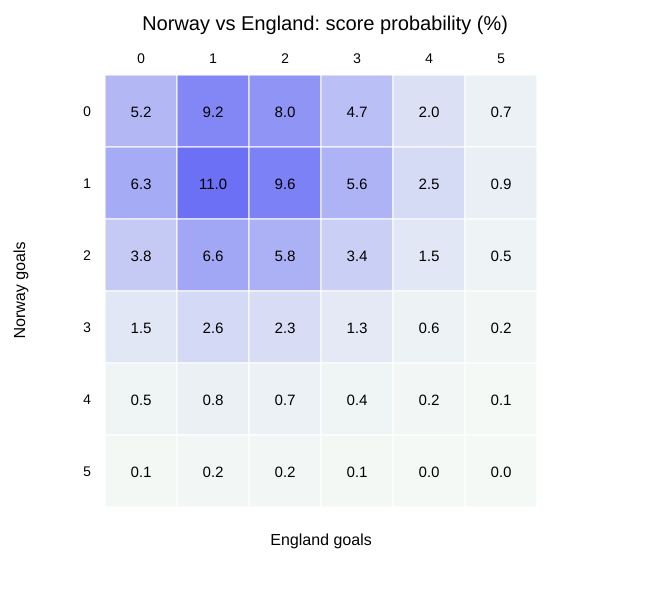

# Polymarket 世界杯盘口量化预测报告

**比赛：** 挪威 vs 英格兰（世界杯四分之一决赛）  
**开球：** 2026-07-12 05:00，北京时间（2026-07-11 17:00 ET）  
**盘口快照：** 2026-07-11 20:33，北京时间  
**覆盖范围：** 65 个合约；均按 90 分钟常规时间加补时结算，只有“晋级/加时/点球”例外  
**结论性质：** 概率研究，不构成保证收益或个性化投资建议

## 一、执行摘要

模型中央预测为：**英格兰 90 分钟胜 50.3%，平局 23.5%，挪威胜 26.2%；英格兰晋级 64.4%，挪威晋级 35.6%**。预期进球为挪威 1.20、英格兰 1.75，总计 2.95；最可能比分依次为 1-1（11.0%）、1-2（9.6%）、0-1（9.2%）、0-2（8.0%）。

模型与 Polymarket 主盘高度一致。所有合约的中央估值偏差均小于 4 个百分点，且在预设的进球强度压力区间下没有稳健越过 4 个百分点阈值的信号。因此本次最严谨的交易结论是：**主盘无明确可执行优势，等待首发阵容后再估值优于现在勉强下注。**

相对倾向上，模型认为市场略高估“进加时”（市场 27.0%，模型 23.5%）和“双方都进球”（61.0% vs 57.7%），但差距分别只有 3.5 和 3.3 个百分点，尚不足以覆盖动态盘口、买卖价差、模型误差与临场阵容风险。

## 二、核心盘口预测

| 合约 | Polymarket | 模型 | 偏差（模型-市场） | 压力区间 | 判断 |
|---|---:|---:|---:|---:|---|
| 挪威 90 分钟胜 | 24.4% | 26.2% | +1.8pp | 20.6%–32.3% | 观望 |
| 平局 | 25.1% | 23.5% | -1.6pp | 22.2%–25.0% | 观望 |
| 英格兰 90 分钟胜 | 50.5% | 50.3% | -0.2pp | 43.4%–57.2% | 观望 |
| 挪威晋级 | 35.0% | 35.6% | +0.6pp | 29.5%–42.0% | 观望 |
| 总进球大 2.5 | 57.0% | 56.6% | -0.4pp | 49.4%–63.0% | 观望 |
| 双方都进球 | 61.0% | 57.7% | -3.3pp | 51.9%–63.0% | 偏 No，优势不足 |
| 进入加时 | 27.0% | 23.5% | -3.5pp | 22.2%–25.0% | 偏 No，临界不足 |
| 进入点球 | 14.0% | 12.9% | -1.1pp | 12.2%–13.7% | 观望 |

正确比分合约中，市场与模型差异最大的几个为：1-2 的市场价 12.0% 高于模型 9.6%；1-1 的 13.0% 高于模型 11.0%；“其他比分”的 11.0% 低于模型 13.1%。这些差异仍不足以作为单独交易依据，且正确比分合约的盘口深度与点差通常劣于主盘。

完整 65 个合约的市场价格、模型概率、偏差和情景区间见 `outputs/all_market_predictions.csv`。

## 三、假设与模型

可证伪假设是：在赛前阵容信息基本确定、没有极端天气中断的条件下，两队 90 分钟进球数可由独立泊松过程近似；球队强弱和比赛节奏通过进球强度参数进入模型。

模型从三类独立信息交叉校准，而不是直接复制 Polymarket：

1. 主流体育博彩的去水前基准：临场附近 90 分钟盘约为挪威 +300、平 +265、英格兰 -110；晋级盘约英格兰 -215、挪威 +175；大 2.5 约 -140。
2. 比赛信息：挪威本届赛事每场均进球并刚以 2-1 淘汰巴西；英格兰 3-2 淘汰墨西哥，但 Quansah 停赛。Rice、Guéhi 和 Reece James 已恢复合练，临场可用性仍有不确定性。
3. 市场内部一致性：总进球 2.5、球队进球和半场无进球概率用于检验进球总量及前后半场分配，最终取挪威 1.20、英格兰 1.75，第一半场占总进球强度 40%。

晋级概率在 90 分钟平局后假设英格兰晋级条件概率为 60%；进入点球的概率设为“90 分钟平局”的 55%。这些是透明、可替换的结构性假设，不是历史样本回测结果。

## 四、数据审计与结算规则

- Polymarket 原站 API 在本次环境中连接超时，所以盘口取自跟踪 Polymarket 订单簿的第三方镜像，并用多个页面交叉核对；这是本报告最大的操作性局限。
- 主盘、比分、总进球与球队进球通常只计算 90 分钟加补时，不含加时和点球。晋级盘则包含加时、点球或赛事组织方的正式裁决。
- 盘口持续变化。CSV 是 20:33 的研究快照，不代表开球前最终可成交买一/卖一；第三方页面展示的中间价也不等于真实成交价。
- 第三方页面对个别合约存在四舍五入，且 0%/100% 显示可能只是低于 0.5%/高于 99.5%，不能按严格零概率解释。
- 17 个正确比分展示价合计为 108%，反映逐合约点差、抓取非同步与整数四舍五入，不能把它们当作同一时刻可无摩擦成交的公平概率。输出 CSV 同时给出除以 108% 后的归一化参考列，但交易偏差仍按实际展示价计算。
- 本任务是单场赛前预测，没有足够的同口径历史盘口快照来做真正的样本外回测；因此没有伪造 Sharpe、胜率或收益曲线。

## 五、稳健性与风险控制

压力测试将两队预期进球分别上下移动 0.15。英格兰 90 分钟胜率在 43.4%–57.2% 之间，挪威胜率在 20.6%–32.3% 之间，大 2.5 在 49.4%–63.0% 之间。主盘口边际明显小于模型区间，说明参数风险大于表面价差。

如一定要做纸面执行，建议只使用限价单，并把“最低净优势”设为至少 5 个百分点，且需在首发公布后重算；单一二元合约风险预算不超过总研究资金的 0.5%，正确比分类合约合计不超过 0.25%。真实交易还必须计入买卖价差、成交深度、滑点、链上操作和地区合规限制。

需要触发重新估值的事件包括：Rice、Guéhi、Reece James 任一缺阵；Haaland 或 Kane 不首发；雷暴导致明显延迟；主盘移动超过 4 个百分点；或实际买卖价差超过 2 美分。

## 六、资料来源

- [FIFA 世界杯赛程](https://www.fifa.com/en/tournaments/mens/worldcup/canadamexicousa2026/articles/match-schedule-fixtures-results-teams-stadiums)
- [Polymarket API 市场获取文档](https://docs.polymarket.com/market-data/fetching-markets)
- [Polymarket More Markets 镜像快照](https://polymarket.com.se/event/sports/fifwc-nor-eng-2026-07-11-more-markets)
- [Polymarket Exact Score 镜像快照](https://polymarket.com.se/event/sports/general/fifwc-nor-eng-2026-07-11-exact-score)
- [Struct 晋级盘及结算规则](https://explorer.struct.to/markets/fifwc-nor-eng-2026-07-11-team-to-advance)
- [Oddschecker 临场赔率对照](https://www.oddschecker.com/us/soccer/world-cup/norway-v-england)
- [VegasInsider 赔率移动](https://www.vegasinsider.com/soccer/norway-england-odds-world-cup-2026/)
- [Sports Mole 阵容与伤停](https://www.sportsmole.co.uk/football/england/world-cup-2026/team-news/norway-vs-england-injury-suspension-list-predicted-xis_600930.html)
- [Sports Mole 最新合练信息](https://www.sportsmole.co.uk/football/england/injury-news/news/tuchels-triple-injury-boost-but-one-player-misses-training-before-norway_601036.html)

## 七、结论

已完成 65 个相关 Polymarket 合约的统一概率预测。关键结果是英格兰 90 分钟胜约 50.3%、晋级约 64.4%，模型比分中枢约为挪威 1.20–1.75 英格兰。主要限制是动态盘口来自第三方订单簿镜像、没有逐笔买卖价差，以及单场泊松模型的结构误差。下一步最有价值的测试是在首发公布后，将阵容变化映射到两队预期进球并重新抓取盘口；若仍无至少 5pp 的净优势，则继续不交易。
